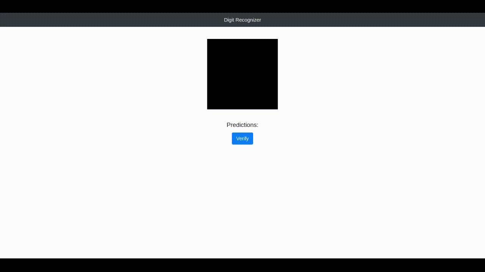

# Digit Recognizer

Implementing a Convolutional Neural Network in Python using Tensorflow and Keras.

## Demo

## Software Requirements

- [Flask](https://flask.palletsprojects.com/) - A micro web framework written in Python
- [Tensorflow](tensorflow.org) - An end-to-end open source platform for machine learning
- [Bootstrap](https://getbootstrap.com/) - A free and open-source CSS framework
